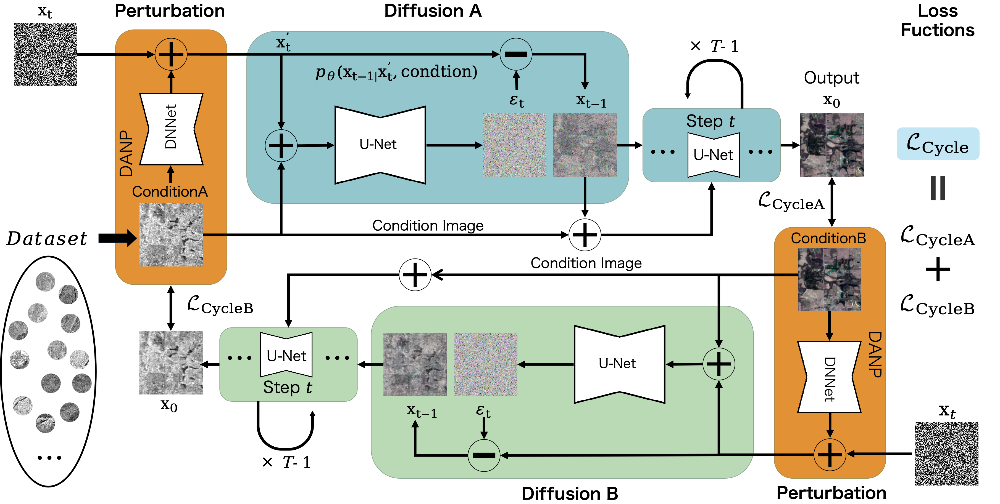
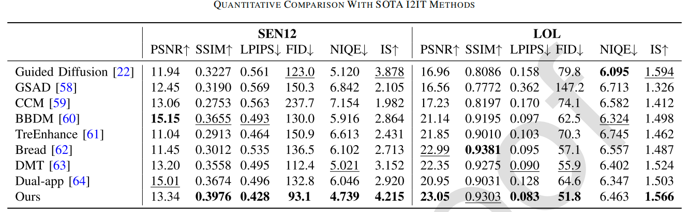
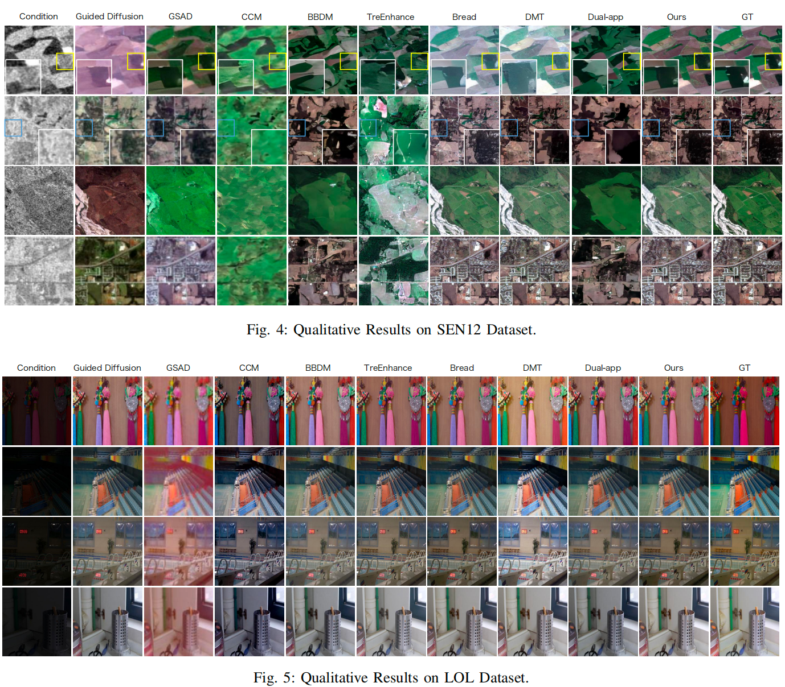

# AdaNoise: Cycle-Consistent Image Translation with Domain-Adaptive Noise Perturbation (TCSVT 2025)

Official PyTorch Implementation of AdaNoise

  <a href="https://ieeexplore.ieee.org/document/11475499">📄 Paper</a>

---

# Abstract

Image-to-image (I2I) translation aims to transform an input image into a target domain while preserving its structural details. Recent advances in diffusion-based generative models have significantly improved the perceptual quality of generated images; however, these approaches still face challenges in controllability and consistency, largely due to the inherent randomness introduced by stochastic noise during the generation process. Specifically, directly manipulating noise distributions without semantic alignment can lead to mode collapse, texture distortion, or loss of domain-specific features.

To overcome these challenges, we propose the Adaptive Noise Framework (AdaNoise), a novel cycle-consistent image-to-image translation approach guided by domain-adaptive noise modulation. AdaNoise introduces a Domain-Adaptive Noise Perturbation (DANP) module, which adaptively learns structured noise patterns aligned with the target domain distribution, enhancing both the expressiveness and reliability of the translation process. Through integration with a Cycle-Consistent Dual Diffusion (CDD) architecture, AdaNoise ensures faithful content reconstruction while allowing semantically meaningful domain shifts.

The proposed framework effectively balances generation quality and controllability, enabling more faithful and flexible image translation. Extensive experiments on SAR-to-optical image translation and low-light image enhancement demonstrate that AdaNoise consistently outperforms existing state-of-the-art methods in image fidelity, semantic preservation, and controllability, providing a robust and scalable solution for cross-domain visual generation.

---

# Framework Overview

  

Overall architecture of AdaNoise. The proposed framework consists of a Domain-Adaptive Noise Perturbation (DANP) module and a Cycle-Consistent Dual Diffusion (CDD) architecture, enabling controllable image translation while preserving structural and semantic consistency.

---

# Experimental Results

## Quantitative Comparison

  

AdaNoise consistently achieves superior quantitative performance across multiple datasets and evaluation metrics.

## Qualitative Comparison

  

Visual comparisons demonstrate that AdaNoise generates images with enhanced semantic consistency, richer textures, and improved visual fidelity.

# Environment

bash Python 3.10 PyTorch 2.0+ CUDA 11.8 

---

# Citation

If you find this project useful for your research, please consider citing:

bibtex @article{yang2025adanoise,   title={AdaNoise: Cycle-Consistent Image Translation with Domain-Adaptive Noise Perturbation},   author={Yang, Xi and Shi, Haoyuan and Gao, Fei and Wang, Nannan},   journal={IEEE Transactions on Image Processing},   year={2025},   publisher={IEEE},   doi={10.1109/TIP.2025.3680269} } 

---

⭐ If you find this repository useful, please consider giving it a star.

